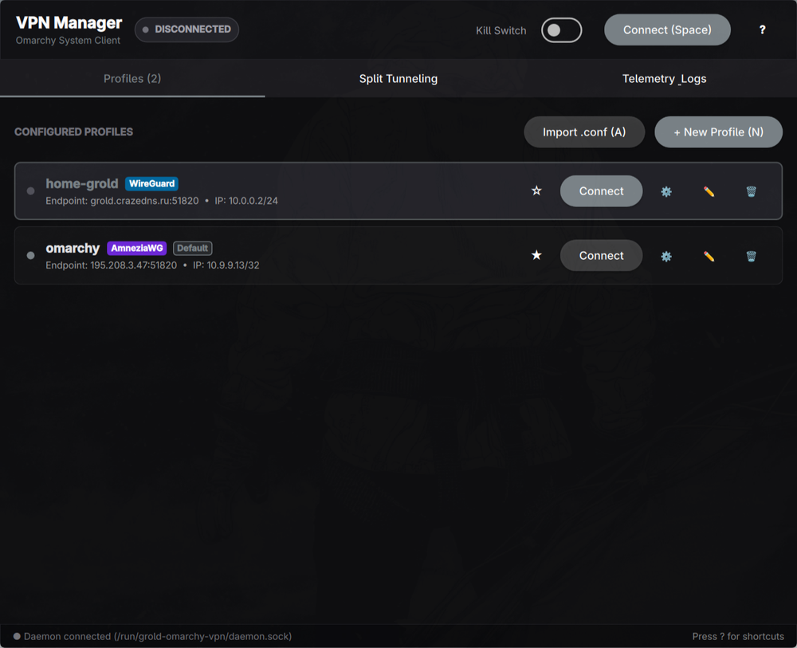
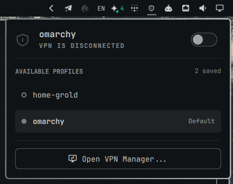

# grold-omarchy-vpn

WireGuard and AmneziaWG VPN connection manager and status bar widget for Omarchy Linux.

Built following the [Omarchy App](https://omarchy.org) conventions: one window, Material dark design following the desktop accent live, keyboard-driven navigation, systemd daemon with JSON-RPC IPC, and native Quickshell status bar plugin.

---

## Screenshots

<div align="center">
  
  <p><em>Desktop Application: Hero telemetry bar, active throughput rates, profile management, and shortcuts.</em></p>
  <br />
  
  <p><em>Omarchy System Bar Widget (<code>grold.vpn</code>): Right-click quick toggle, default profile switcher, and live stats.</em></p>
</div>

---

## Features

- **WireGuard & AmneziaWG 3.1**: Full support for standard WireGuard `.conf` files as well as AmneziaWG obfuscation parameters (`Jc`, `Jmin`, `Jmax`, `S1`, `S2`, `H1`, `H2`, `H3`, `H4`, `I1`, `I2`).
- **Hybrid UI Form Factor**:
  - **Omarchy Shell Bar Widget (`grold.vpn`)**: Lives in your status bar; displays an icon with connection dot indicator, real-time download/upload speed, quick ON/OFF toggle, right-click instant connection, profile switcher with default profile badges, and one-click launcher to open the main app.
  - **Desktop Application (`grold-omarchy-vpn`)**: Standalone Qt Quick GUI for profile management, split tunneling rules, live bandwidth charts, and session logs.
- **Split Tunneling (App & IP Routing)**:
  - **Exclusive / Bypass Mode**: Routes all system traffic through the VPN, except selected applications and IP/CIDR ranges.
  - **Inclusive Mode**: Direct internet by default, routing only selected applications and target IP/CIDR ranges through the VPN tunnel.
  - **App Routing via cgroups v2 & nftables**: Select installed desktop apps directly from a list scanned from `/usr/share/applications/`, or run CLI programs using `grold-omarchy-vpn-run`.
- **Kill Switch & DNS Protection**: Configurable firewall kill switch via `nftables` that prevents leaks if the tunnel drops.
- **Comprehensive Telemetry**: Real-time throughput graph (KB/s, MB/s), session Rx/Tx counters, connection uptime, handshake timestamps, and persistent historical connection logs.
- **Dual-Mode Config Editor**: Edit profiles using either a structured GUI form or directly in the raw `.conf` syntax editor.
- **Import / Export**: Import `.conf` files seamlessly through the XDG Desktop Portal file picker.

---

## Keyboard Shortcuts (Desktop App)

| Key | Action |
| :--- | :--- |
| `Space` | Toggle VPN connection (Connect / Disconnect active or default profile) |
| `Enter` / `Return` | Connect to currently selected profile |
| `Down` / `J` | Select next profile in list |
| `Up` / `K` | Select previous profile in list |
| `D` | Set selected profile as Default |
| `A` | Import configuration (`.conf`) via Desktop Portal |
| `N` | Create new profile manually |
| `E` | Edit configuration of selected profile |
| `S` | Configure split tunneling routing rules |
| `Delete` | Delete selected profile |
| `R` | Refresh profiles and daemon status |
| `?` | Toggle shortcuts help overlay |
| `Q` | Quit application |

---

## Architecture

```text
┌────────────────────────────────────────────────────────┐
│                   Omarchy Desktop                      │
├───────────────────────────┬────────────────────────────┤
│  Omarchy Shell Bar Plugin │  Standalone Desktop App    │
│  (Quickshell / QML)       │  (C++ / Qt Quick / QML)    │
│  ~/.config/omarchy/       │  grold-omarchy-vpn         │
│  plugins/grold.vpn/       │                            │
└─────────────┬─────────────┴─────────────┬──────────────┘
              │                           │
              │   Unix Domain Socket      │
              │   /run/grold-omarchy-vpn/ │
              │   daemon.sock             │
              ▼                           ▼
┌────────────────────────────────────────────────────────┐
│             Background Daemon (C++)                    │
│             grold-omarchy-vpnd                         │
│  • Manages awg / awg-quick interfaces                  │
│  • Applies nftables rules & cgroups v2 routing         │
│  • Enforces Kill Switch & DNS policies                 │
│  • Telemetry collector (speeds, Rx/Tx, handshakes)     │
└────────────────────────────────────────────────────────┘
```

---

## CLI Utilities

### `grold-omarchy-vpn-ctl`
Query status or send commands to the daemon:
```bash
grold-omarchy-vpn-ctl status
grold-omarchy-vpn-ctl --json status
grold-omarchy-vpn-ctl toggle
grold-omarchy-vpn-ctl connect /path/to/profile.conf
grold-omarchy-vpn-ctl disconnect
grold-omarchy-vpn-ctl killswitch on
```

### `grold-omarchy-vpn-run`
Run any terminal command or application inside the target routing cgroup:
```bash
# Route through VPN in inclusive mode:
grold-omarchy-vpn-run curl ifconfig.me

# Bypass VPN in exclusive mode:
grold-omarchy-vpn-run --bypass steam
```

---

## Building and Testing

Build all targets:
```bash
./bin/build
```

Run test suite:
```bash
./bin/test
```

Run during development:
```bash
./bin/dev-run
```

Install as an Arch package & shell plugin:
```bash
./bin/install
```

---

## Configuration Paths

- VPN Profiles: `~/.config/grold-omarchy-vpn/profiles/<name>.conf` (0600 permissions)
- Profile Metadata: `~/.config/grold-omarchy-vpn/profiles/<name>.meta.json`
- Default Profile: `~/.config/grold-omarchy-vpn/default-profile`
- Historical Logs: `~/.local/share/grold-omarchy-vpn/history.json`
- Daemon Socket: `/run/grold-omarchy-vpn/daemon.sock`
- Shell Plugin: `~/.config/omarchy/plugins/grold.vpn/`
